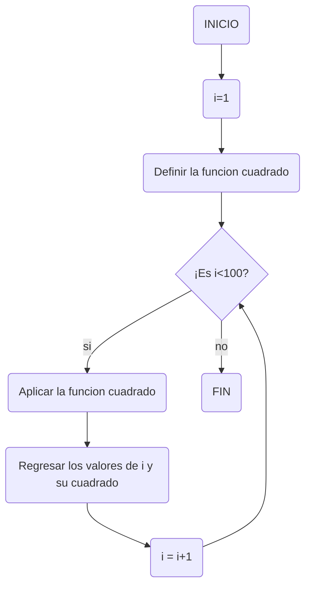
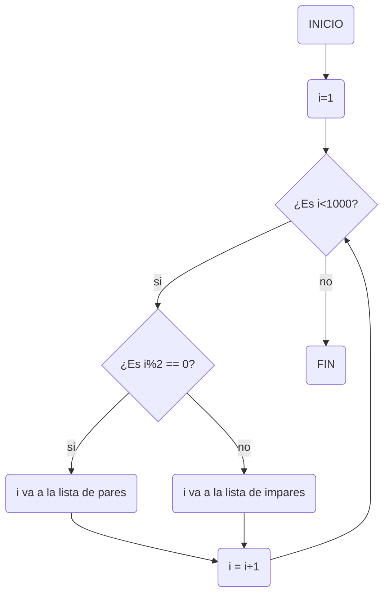
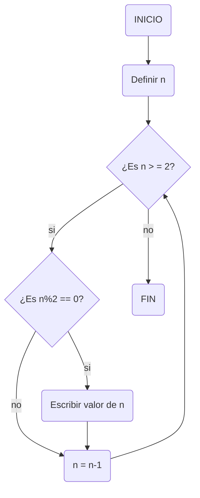

# Reto-7
## Bucles 1
Los bucles son un recurso de python el cual nos permite analizar un valor en varias ocasiones hasta que ya deje de cumplir una condición.

Para este reto habian un total de 8 puntos los cuales variaban en su dificultad mucho a mi parecer. Pero aquí estan los 8 puntos y los tres diagramas de flujo para los correspondientes tres primeros.

### Punto 1 / Listado del 1 al 100 y sus cuadrados
```py
def cuadradonumero (i=int)->int:
    return (i**2)

#numero del 1 al 100 y sus cuadrados

if __name__ == "__main__":

    i:int=1

print("Lista de numeros del 1 al 100 y sus cuadrados:")
print("INICIO")

while i<=100:
    cuadrado=cuadradonumero(i)
    print(str(i)+" , "+str(cuadrado))
    i+=1

print ("FIN")
```
#### Diagrama de flujo 1


### Punto 2 / Listado Pares e Impares del 1 al 1000
```py
#listado de numeros impares y pares

i:int=1

print("Listado de numeros impares del 1 hasta el 999:")
print("INICIO")

while i<1000:
    if i % 2 != 0:
        print(str(i))
    i += 1

print("FIN")

i -= 998

print("Listado de numeros pares del 2 hasta el 1000:")
print("INICIO")

while i<=1000:
    if i % 2 == 0:
        print(str(i))
    i += 1

print("FIN")
```
#### Diagrama de flujo 2


### Punto 3 / Listado descendente de numeros pares hasta el 2
```py
#listado descendente de numero pares desde un n hasta el 2

n=int(input("Ingrese un numero natural: "))

print("Listado de numeros pares descendentemente desde "+str(n)+" hasta 2:")
print("INICIO")

while n>=2:
    if n % 2 == 0:
        print(n)
    n -= 1

print("FIN")
```
#### Diagrama de flujo 3


### Punto 4 / Población del país A y B
Este punto necesita un poco de explicación. Hay dos paises, cada uno con un porcentaje de crecimiento anual, los cuales son: 2% para el país A y 3% para el país B. El país A tiene una población de 25 millones de personas, mientras que el B tiene 18.9 millones. El tema es ¿Cuándo el país B rebasara al país A en población con respecto a años?
```py
def crecimiento_A(poblacionA=int)->int:
    return (poblacionA*(2/100))

def crecimiento_B(poblacionB=int)->int:
    return (poblacionB*(3/100))

if __name__ == "__main__":

    poblacionA:int=25000000
    poblacionB:int=18900000
    i:int=1

    crecimientoA=crecimiento_A(poblacionA)
    crecimientoB=crecimiento_B(poblacionB)

while poblacionA > poblacionB:
    poblacionA += crecimientoA
    poblacionB += crecimientoB
    i += 1

print("En el año en el que la poblacion B pasa a la poblacion A es en el año "+str(i)+" donde la poblacion B es de "+str(poblacionB)+" y la de A es de "+str(poblacionA))
```

Como se puede apreciar se tiene definido dos funciones, las cuales son los crecimientos poblacionales de cada país, las poblaciones, que es lo que vamos a usar como base del programa, y los años, lo cual esta denominado como i en el programa y que cada vez que se genera un ciclo va aumentando una unidad.

### Punto 5 / El factorial de un número n
```py
num=int(input("Ingrese el numero natural del cual quiere saber su factorial: "))
i:int=1
factorial:int=1

while i <= num:
    factorial *= i
    i += 1

print("El factorial de "+str(num)+" es "+str(factorial))
```

### Punto 6 / Adivinanza de un número del 1 al 100
```py

```
no lo pude hacer

### Punto 7 / Divisores de un número del 2 al 50
```py
dividendo=int(input("Ingrese un numero natural del 2 al 50: "))
divisor:int=1

print("Los divisores del numero "+str(dividendo)+" son:")

while dividendo>=2 and dividendo<=50:
    if dividendo%divisor == 0:
        print(divisor)
    divisor += 1

print("FIN")
```

### Punto 8 / Listado de números primos del 1 al 100
```py

```
no lo pude hacer
